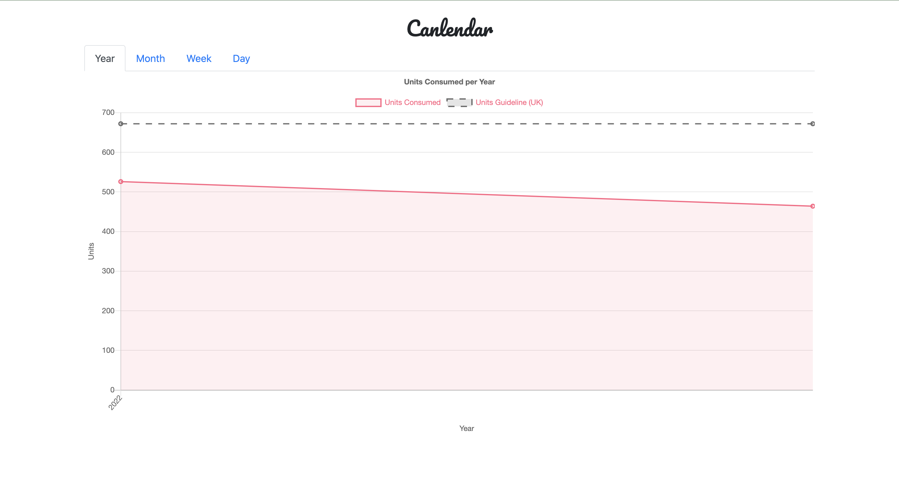
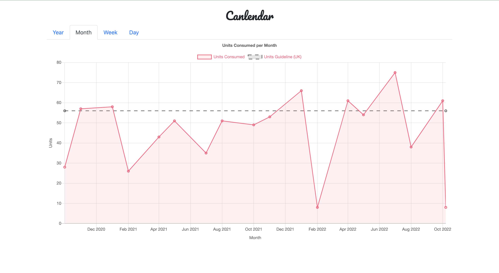
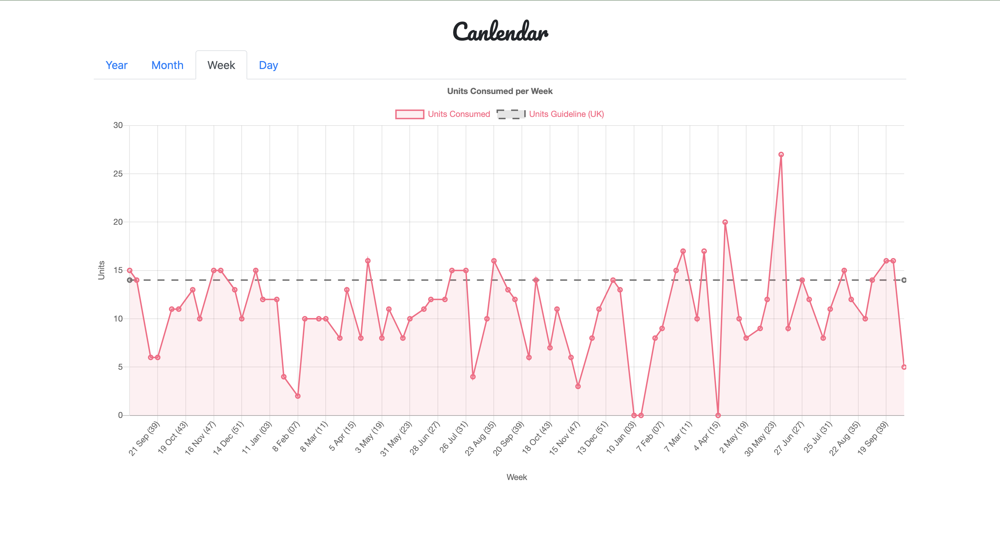
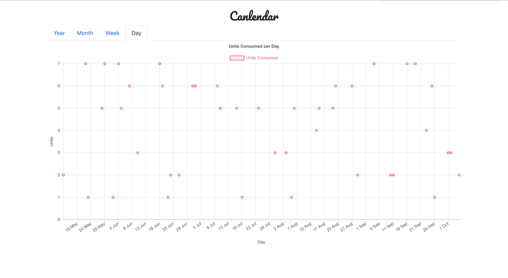

# Canlendar Graph

[](https://circleci.com/gh/jemgunay/canlendar-graph/tree/master)

A web app for graphing alcohol unit intake documented via Google calendar events. Year, month, week and day views are
available.

<p align="center">
  
  
</p>
<p align="center">
  
  
</p>
Note: Above is mocked data.

## Implementation

* Deployed to Google Cloud Run (serverless) and scales to zero.
* File server for serving static web app files.
* Endpoint for scraping alcohol unit data from calendar events via the Google Calendar API; this unit data is then
  stored in InfluxDB. This endpoint is executed on a fixed interval via Cloud Scheduler.

```bash
curl -i -XPOST "localhost:8080/api/v1/collect" -d '{}'
curl -i -XPOST "localhost:8080/api/v1/collect" -d '{"start_time_override": "2009-11-10T23:00:00Z"}'
```

* Endpoint for querying alcohol unit consumption data stored in InfluxDB. Supported aggregations are `year`, `month`
  , `week` and `day`.

```bash
curl -i -XGET "localhost:8080/api/v1/query?aggregation=week&end_time=2022-08-25T21:42:09Z"
curl -i -XGET "localhost:8080/api/v1/query?aggregation=day&start_time=2022-08-10T21:42:09Z&end_time=2022-08-25T21:42:09Z"
```

## Setup

1) Create a Service Account (SA) for your project
1) Invite the SA email address to your calendar
1) Create a key for the Service Account associated with your calendar; download the credentials key file
1) Accept the invite for your SA with the `cmd/insert/main.go` script, passing in your calendar's ID:

```bash
go run main.go --calendar-id "abcdefghijklmop123456789@group.calendar.google.com" --creds-file ./credentials.json
2022/06/22 00:53:52 successfully inserted
```

### Running Locally

1) Ensure the credentials key file downloaded in the setup stage resides as `./config/credentials.json`
1) Run with `go run main.go --local`
1) Navigate to `http://localhost:8080`

### Deploy to GCP

```bash
gcloud run deploy
```

## Demo

A demo version of the app with mocked data for all available views (navigate to `http://localhost:8080`).

```bash
cd cmd/bash
go run main.go
# Navigate to http://localhost:8080
```